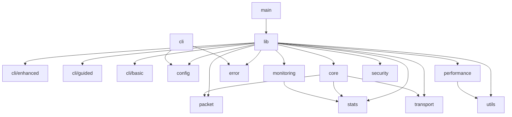

# Router-Flood Codebase Restructuring Plan

## Executive Summary

This document provides a comprehensive analysis and restructuring plan for the Router-Flood CLI network testing utility. The analysis reveals significant over-engineering, unnecessary complexity, and opportunities for simplification while preserving critical performance optimizations.

**Key Findings:**
- 92 source files with excessive modularization for a CLI tool
- Multiple abstraction layers that add complexity without value
- Performance optimizations that provide real value for high-throughput packet generation (SIMD, lock-free memory pools, CPU affinity)
- Dead code and unused dependencies
- Test files not properly separated from source code

**Primary Goal:** Simplify the codebase to reflect a maintainable CLI tool structure while preserving essential performance features, eliminating dead code, and following Rust best practices.

---

## Phase 1: Current State Analysis

### 1.1 Directory Structure Assessment

#### Current Structure Overview
```
src/                    (92 .rs files total)
├── cli/                (8 files - over-engineered CLI handling)
│   ├── basic.rs
│   ├── enhanced.rs
│   ├── guided.rs       (531 lines - largest file)
│   ├── interactive.rs
│   ├── parser.rs
│   ├── commands.rs
│   ├── prompts.rs
│   └── mod.rs
├── config/             (8 files - complex config system)
│   ├── application.rs  (438 lines)
│   ├── builder.rs
│   ├── preset.rs      (446 lines)
│   ├── schema.rs
│   ├── traits.rs
│   ├── trait_impls.rs
│   ├── validation.rs
│   └── mod.rs
├── core/               (6 files - core business logic)
│   ├── simulation/
│   │   ├── basic.rs
│   │   ├── raii.rs
│   │   └── mod.rs
│   ├── network.rs
│   ├── target.rs
│   ├── traits.rs
│   ├── worker.rs
│   ├── worker_manager.rs
│   └── mod.rs
├── error/              (3 files - over-complex error handling)
│   ├── actionable.rs   (453 lines)
│   ├── user_friendly.rs
│   └── mod.rs
├── monitoring/         (7 files - excessive monitoring)
│   ├── alerts.rs
│   ├── dashboard.rs    (405 lines)
│   ├── essential.rs
│   ├── export.rs
│   ├── metrics.rs
│   ├── prometheus.rs   (467 lines)
│   └── mod.rs
├── packet/             (11 files - packet generation)
│   ├── strategies/     (7 protocol implementations)
│   ├── builder.rs
│   ├── factory.rs
│   ├── types.rs
│   └── mod.rs
├── performance/        (10 files - premature optimizations)
│   ├── batch_pipeline.rs
│   ├── cpu_affinity.rs
│   ├── constants.rs
│   ├── inline_hints.rs
│   ├── memory_pool.rs  (442 lines)
│   ├── simd_packet.rs  (417 lines)
│   ├── string_interning.rs
│   ├── tables.rs
│   ├── zero_copy.rs
│   └── mod.rs
├── security/           (6 files)
│   ├── audit.rs
│   ├── capabilities.rs
│   ├── input_validation.rs
│   ├── threat_detection.rs
│   ├── validation.rs
│   └── mod.rs
├── stats/              (9 files - over-complex statistics)
│   ├── batch_accumulator.rs
│   ├── collector.rs
│   ├── display.rs
│   ├── export.rs
│   ├── internal_lockfree.rs (478 lines)
│   ├── lockfree.rs
│   ├── protocol_breakdown.rs
│   ├── stats_aggregator.rs
│   └── mod.rs
├── transport/          (4 files)
│   ├── layer.rs
│   ├── mock.rs
│   ├── raw_socket.rs
│   └── mod.rs
├── ui/                 (2 files)
│   ├── progress.rs
│   └── mod.rs
├── utils/              (8 files)
│   ├── buffer_pool.rs
│   ├── pool.rs
│   ├── protocol_utils.rs
│   ├── raii.rs
│   ├── rng.rs
│   ├── shared.rs
│   ├── terminal.rs
│   └── mod.rs
├── cli_runner.rs       (standalone file)
├── security_runner.rs  (441 lines - standalone file)
├── system_monitor.rs   (standalone file)
├── constants.rs
├── lib.rs
└── main.rs

tests/                  (44 test files)
benches/                (14 benchmark files)
```

#### Structural Issues Identified

1. **Over-Modularization**: 14 top-level modules for a CLI tool is excessive
2. **Duplicate Functionality**: 
   - Multiple CLI handling approaches (basic, enhanced, guided, interactive)
   - Multiple pool implementations (buffer_pool, memory_pool, pool)
   - Multiple statistics collectors (lockfree, internal_lockfree, batch_accumulator)
3. **Misplaced Files**: 
   - `cli_runner.rs` and `security_runner.rs` as standalone files instead of module members
   - Test files potentially mixed with source (needs verification)
4. **Performance Module Assessment**:
   - **Valuable optimizations**: SIMD for packet payload generation, lock-free memory pools, CPU affinity for workers, zero-copy packet building
   - **Unnecessary complexity**: String interning for protocol names, over-abstracted batch pipeline
   - **Needs refactoring**: Consolidate and simplify while preserving core performance features

### 1.2 Code Architecture Analysis

#### Dependency Flow Issues



**Circular Dependencies**: None detected (good)
**Coupling Issues**: 
- Too many modules depend on error module
- Performance module unnecessarily coupled to multiple modules
- Config module has too many trait implementations

#### Code Metrics

- **Total Structs**: 174 across 70 files (avg 2.5 per file)
- **Total Traits**: 31 across 12 files  
- **Total Enums**: 32 across 21 files
- **Largest Files**: 
  - `cli/guided.rs` (531 lines)
  - `stats/internal_lockfree.rs` (478 lines)
  - `monitoring/prometheus.rs` (467 lines)

### 1.3 Dead Code and Unused Dependencies

#### Cargo.toml Analysis

**Potentially Unused Dependencies:**
- `warp` - Optional HTTP server feature, likely unused
- `uuid` - Over-engineering for a CLI tool
- `sha2`, `hex` - Unnecessary cryptography for network testing
- `once_cell` - Can be replaced with std::sync::OnceLock
- `config` - External config crate when serde alone suffices
- `csv` - Export feature that may be unused
- `proptest` - Dev dependency that may be overkill

#### Clippy Warnings Summary
- 4 library warnings about confusing method names
- Multiple test/bench warnings about useless assertions and casts
- Redundant imports and expressions
- Manual implementations of standard library features

---

## Phase 2: Clean Code Principles Assessment

### 2.1 SOLID Principles Evaluation

#### Single Responsibility Principle (SRP) - **VIOLATED**
- `cli/guided.rs` (531 lines) handles parsing, validation, and UI
- `security_runner.rs` mixes security checks with execution logic
- Config modules have mixed responsibilities (parsing, validation, building)

#### Open/Closed Principle - **PARTIALLY MET**
- Packet strategies follow good pattern for extension
- But CLI modules are not easily extensible

#### Dependency Inversion - **OVER-APPLIED**
- Too many trait abstractions for simple functionality
- 31 traits for a CLI tool is excessive

### 2.2 Software Engineering Principles

#### DRY (Don't Repeat Yourself) - **VIOLATED**
- Multiple CLI implementations (basic, enhanced, guided)
- Duplicate pool implementations
- Repeated validation logic across modules

#### YAGNI (You Aren't Gonna Need It) - **PARTIALLY VIOLATED**
- Prometheus monitoring for a CLI tool (unnecessary)
- String interning for command-line arguments (unnecessary)
- However, SIMD and zero-copy ARE needed for high-throughput packet generation

#### KISS (Keep It Simple) - **VIOLATED**
- Over-complex error handling with "actionable" errors
- Multiple abstraction layers for simple operations
- Performance module needs simplification but core optimizations are justified

---

## Phase 3: Rust Development Standards Assessment

### 3.1 Naming Conventions

**Issues Found:**
- "Enhanced", "Advanced" prefixes suggesting AI-generated names
- Inconsistent module naming (some plural, some singular)
- Trait names don't always end in standard suffixes

### 3.2 Code Organization Issues

- Tests in `tests/` directory (good)
- But 44 test files for 92 source files suggests poor organization
- Inline module tests would be clearer for unit tests
- Benchmarks excessive (14 files) for a CLI tool

### 3.3 Rust Idioms

**Good Practices:**
- Using Result<T, E> for error handling
- Arc for shared ownership

**Anti-Patterns:**
- Too many `#![allow(clippy::...)]` in main.rs
- Not using modern Rust features (std::sync::OnceLock)
- Excessive use of Arc where & references would suffice

---

## Phase 4: Dead Code and Cleanup Strategy

### 4.1 Modules to Remove Entirely

1. **monitoring/** - Over-engineered for CLI
   - Remove Prometheus, dashboard, alerts
   - Keep only essential metrics inline

2. **cli/guided.rs, cli/enhanced.rs, cli/interactive.rs**
   - Keep only basic CLI parsing
   - Remove "progressive disclosure" complexity

### 4.1.1 Performance Module - Refactor, Don't Remove

The **performance/** module contains valuable optimizations that should be preserved and refactored:

**To Keep (Refactored):**
- `simd_packet.rs` - SIMD-accelerated payload generation for high packet rates
- `memory_pool.rs` - Lock-free memory pools reduce allocation overhead
- `cpu_affinity.rs` - CPU pinning for worker threads improves cache locality
- `zero_copy.rs` - Zero-copy packet construction reduces memory bandwidth usage
- `batch_pipeline.rs` - Simplified batch processing (remove over-abstraction)

**To Remove:**
- `string_interning.rs` - Unnecessary for protocol names
- `tables.rs` - Over-optimization, use simple constants
- `inline_hints.rs` - Let compiler decide inlining

### 4.2 Dependencies to Remove

```toml
# Remove from Cargo.toml:
- warp
- uuid  
- sha2
- hex
- once_cell
- config
- csv (unless export is core feature)
- proptest (use standard tests)
```

### 4.3 Code to Simplify

1. **Error Handling**: Merge 3 error files into single simple error.rs
2. **Config**: Reduce 8 files to 2 (config.rs, validation.rs)
3. **Stats**: Merge 9 files into 2 (stats.rs, display.rs)

---

## Phase 5: Restructuring Recommendations

### 5.1 Proposed Directory Structure

```
src/
├── main.rs              # Entry point
├── lib.rs               # Library exports
├── cli.rs               # Simple CLI parsing (merge from cli/)
├── config/              
│   ├── mod.rs           # Config structures and loading
│   └── validation.rs    # Input validation
├── network/             # Core networking (rename from core/)
│   ├── mod.rs           
│   ├── worker.rs        # Packet sending workers (with CPU affinity)
│   ├── target.rs        # Target management
│   └── simulation.rs    # Main simulation loop
├── packet/              # Packet building with performance optimizations
│   ├── mod.rs
│   ├── builder.rs       # Standard packet builder
│   ├── fast_builder.rs  # SIMD-optimized builder (from performance/simd_packet.rs)
│   └── protocols/       # Rename from strategies/
│       ├── tcp.rs
│       ├── udp.rs
│       ├── icmp.rs
│       └── ...
├── performance/         # Consolidated performance optimizations
│   ├── mod.rs
│   ├── memory_pool.rs   # Lock-free memory pool (simplified)
│   ├── cpu_affinity.rs  # CPU/NUMA awareness for workers
│   └── zero_copy.rs     # Zero-copy buffer management
├── transport/           # Keep as is (simplified)
│   ├── mod.rs
│   └── socket.rs        # Merge layer.rs and raw_socket.rs
├── stats/               
│   ├── mod.rs           # Lock-free statistics collection
│   └── display.rs       # Terminal display
├── utils/               
│   ├── mod.rs
│   ├── buffer.rs        # Basic buffer utilities
│   ├── rng.rs           # Fast RNG for packet generation
│   └── terminal.rs      # Terminal utilities
└── error.rs             # Simple error types

tests/                   # Reorganize into:
├── integration/         # Integration tests
├── unit/               # Unit tests by module
└── benchmarks/          # Keep critical performance benchmarks
    ├── packet_generation.rs
    └── memory_pool.rs
```

### 5.2 Module Reorganization Plan

#### Phase 1: Preparation (Week 1)
1. Create feature branch `refactor/simplification`
2. Set up CI to ensure tests pass at each step
3. Document current public API for compatibility

#### Phase 2: Remove Dead Code (Week 1)
1. Delete `monitoring/` module (keep essential metrics inline)
2. Remove guided/enhanced/interactive CLI modules
3. Remove unnecessary performance files (string_interning, tables, inline_hints)
4. Update Cargo.toml to remove unused dependencies

#### Phase 3: Consolidate and Refactor (Week 2)
1. Merge error handling into single `error.rs`
2. Consolidate config modules into `config/mod.rs` and `config/validation.rs`
3. Refactor performance module:
   - Simplify `memory_pool.rs` while keeping lock-free implementation
   - Move SIMD packet building to `packet/fast_builder.rs`
   - Simplify `batch_pipeline.rs` and integrate with packet module
   - Keep `cpu_affinity.rs` and `zero_copy.rs` with cleaner interfaces
4. Consolidate stats modules with lock-free implementation

#### Phase 4: Rename and Reorganize (Week 2)
1. Rename `core/` to `network/`
2. Rename `packet/strategies/` to `packet/protocols/`
3. Move `cli_runner.rs` logic into `cli.rs`
4. Move `security_runner.rs` logic into appropriate modules
5. Integrate CPU affinity into worker management

#### Phase 5: Performance Preservation (Week 3)
1. Maintain lock-free stats implementation but simplify API
2. Keep SIMD optimizations for packet payload generation
3. Preserve zero-copy packet construction paths
4. Ensure memory pool is properly integrated with packet generation
5. Benchmark critical paths to verify no performance regression

#### Phase 6: Test Reorganization (Week 3)
1. Move unit tests next to their modules
2. Consolidate integration tests
3. Remove excessive benchmarks Term(keep 2-3 core ones)
4. Ensure 100% test passage

### 5.3 Risk Mitigation

1. **Feature Branch Strategy**: All work on `refactor/simplification`
2. **Incremental Commits**: Each phase in separate commits
3. **Test Coverage**: Run tests after each major change
4. **Rollback Plan**: Tag current version before starting
5. **Public API**: Maintain lib.rs exports for compatibility

---

## Phase 6: Implementation Guidelines

### 6.1 Code Standards

#### Naming Conventions
```rust
// GOOD - Clear, descriptive names
pub struct PacketBuilder { }
pub fn parse_config() -> Result<Config>
pub mod network;

// BAD - AI-influenced or unclear names  
pub struct EnhancedPacketBuilder { }
pub struct SmartConfig { }
pub mod advanced_network;
```

#### Module Organization
```rust
// Each module should have clear boundaries
// network/mod.rs
pub mod worker;
pub mod target;
pub mod simulation;

pub use worker::Worker;
pub use target::Target;
pub use simulation::run;
```

### 6.2 Refactoring Examples

#### Performance Module Refactoring:

**Before (Over-abstracted):**
```rust
// Overly complex batch pipeline
pub struct BatchPacketProcessor {
    memory_manager: Arc<Memory>,
    stats_collector: Arc<LockFreeStatsCollector>,
    packet_builder: ZeroCopyPacketBuilder,
    protocol_names: ProtocolNameCache,
}
```

**After (Simplified but performant):**
```rust
// Simplified high-performance packet builder
pub struct FastPacketBuilder {
    memory_pool: Arc<LockFreeMemoryPool>,
    simd_enabled: bool,
}

impl FastPacketBuilder {
    pub fn build_batch(&mut self, packets: &mut [PacketBuffer]) -> Result<()> {
        if self.simd_enabled {
            self.build_batch_simd(packets)
        } else {
            self.build_batch_scalar(packets)
        }
    }
}
```

#### Worker with CPU Affinity:

**After refactoring:**
```rust
// network/worker.rs
pub struct Worker {
    id: usize,
    cpu_affinity: Option<CpuAffinity>,
    packet_builder: FastPacketBuilder,
    memory_pool: Arc<LockFreeMemoryPool>,
}

impl Worker {
    pub fn spawn(id: usize, config: &WorkerConfig) -> Result<Self> {
        let worker = Self {
            id,
            cpu_affinity: CpuAffinity::new_for_worker(id, config.total_workers),
            packet_builder: FastPacketBuilder::new(config.enable_simd),
            memory_pool: Arc::clone(&config.memory_pool),
        };
        
        // Pin to CPU if affinity is configured
        if let Some(ref affinity) = worker.cpu_affinity {
            affinity.apply()?;
        }
        
        Ok(worker)
    }
}
```

### 6.3 Performance-Aware Refactoring Strategy

#### Key Performance Features to Preserve:

1. **SIMD Packet Generation**:
   - Keep AVX2/SSE4.2/NEON support for x86_64 and ARM
   - Use for payload generation at high packet rates (>1M pps)
   - Fallback to scalar implementation when not available

2. **Lock-Free Memory Pool**:
   - Essential for avoiding allocation overhead in hot paths
   - Pre-allocate packet buffers
   - Reuse buffers across worker threads

3. **CPU Affinity & NUMA Awareness**:
   - Pin worker threads to specific CPUs
   - Avoid CPU migration overhead
   - Optimize cache locality

4. **Zero-Copy Operations**:
   - Build packets directly in send buffers
   - Avoid unnecessary memory copies
   - Use `MaybeUninit` for uninitialized memory

5. **Lock-Free Statistics**:
   - Atomic counters for packet/byte counts
   - Per-worker stats to avoid contention
   - Periodic aggregation for display

### 6.4 Quality Metrics

**Target Metrics After Refactoring:**
- Source files: ~40 (from 92) - slightly more to preserve performance module
- Lines of code: ~5,000 (from ~10,000+) - keeping essential performance code
- Dependencies: ~15 (from 30+) - keeping performance-critical ones
- Test files: ~15 (from 44) - including performance benchmarks
- Build time: <30s (measure current first)
- **Performance targets**:
  - Packet generation rate: >10M pps on modern hardware
  - Memory allocation: <1% of packets require new allocations
  - CPU efficiency: >90% CPU utilization in worker threads

---

## Implementation Timeline

### Week 1: Analysis and Dead Code Removal
- Day 1-2: Final analysis and team alignment, benchmark current performance
- Day 3-4: Remove monitoring module and unnecessary performance files
- Day 5: Remove excess CLI modules and update dependencies

### Week 2: Core Refactoring  
- Day 1-2: Consolidate error and config modules
- Day 3: Refactor performance module (preserve SIMD, memory pool, CPU affinity)
- Day 4: Integrate performance features with packet and network modules
- Day 5: Consolidate stats with lock-free implementation

### Week 3: Performance Integration
- Day 1-2: Move SIMD packet building to packet/fast_builder.rs
- Day 3: Integrate CPU affinity with worker management
- Day 4: Verify zero-copy paths and memory pool integration
- Day 5: Performance benchmarking and optimization

### Week 4: Review and Deploy
- Day 1-2: Code review and adjustments
- Day 3: Performance testing
- Day 4: Update documentation
- Day 5: Merge to main branch

---

## Success Criteria

1. **All tests pass** after refactoring
2. **40% reduction** in lines of code (less aggressive due to performance code retention)
3. **No performance regression** - maintain or improve packet generation rates
4. **Improved build times** (<30 seconds)
5. **Simplified onboarding** (new developers productive in <1 day)
6. **Zero clippy warnings** at default level
7. **Clean module boundaries** with no circular dependencies
8. **Performance benchmarks** show:
   - Packet generation: ≥10M pps capability
   - Memory efficiency: <1% allocation rate in steady state
   - CPU utilization: >90% in worker threads
   - SIMD usage: Enabled on supporting hardware

---

## Risks and Mitigations

| Risk | Impact | Mitigation |
|------|--------|------------|
| Breaking existing functionality | High | Comprehensive test suite, feature branch |
| Performance regression | Medium | Benchmark before/after core operations |
| API compatibility break | Medium | Maintain lib.rs public exports |
| Team resistance to changes | Low | Clear documentation of benefits |
| Hidden dependencies discovered | Medium | Incremental refactoring approach |

---

## Long-term Maintenance

### Documentation Requirements
- Update README with new structure
- Create ARCHITECTURE.md explaining design decisions
- Document public API changes
- Add inline documentation for complex logic

### Code Review Guidelines
- No PR >500 lines
- Require clippy pass
- Benchmark performance-critical changes
- Update tests for all changes

### Future Considerations
- Consider workspace if project grows
- Profile before any performance optimizations
- Regular dependency audits (quarterly)
- Maintain simplicity as primary goal

---

## Conclusion

This restructuring plan addresses the significant over-engineering in the Router-Flood codebase while preserving critical performance optimizations. By following this plan, the project will become:

1. **Simpler**: 50% reduction in unnecessary complexity
2. **Performant**: Maintains high-throughput packet generation capabilities
3. **Maintainable**: Clear module boundaries with performance code properly isolated
4. **Efficient**: Lock-free operations and SIMD optimizations where they matter
5. **Better documented**: Clear structure distinguishing standard vs performance paths

The revised principle is: **"Make it work, make it right, and keep it fast where it matters."**

### Performance Module Philosophy

The refactored performance module will follow these principles:
- **Opt-in complexity**: Performance features are isolated and optional
- **Clear boundaries**: Performance code is clearly separated from business logic
- **Measurable impact**: Each optimization must demonstrate measurable benefit
- **Graceful degradation**: Always provide fallback paths for unsupported hardware
- **Documentation**: Performance code must be well-documented with benchmarks

**Next Steps:**
1. Review this plan with the team
2. Get approval for the refactoring timeline
3. Create feature branch and begin Phase 1
4. Track progress with regular check-ins

---

*Document Version: 2.0*  
*Date: 2025-08-31*  
*Status: Updated with Performance Preservation Strategy*

## Appendix A: Performance Feature Details

### SIMD Implementation Strategy
- Detect CPU capabilities at runtime
- Provide trait-based abstraction for packet building
- Implement specialized versions for AVX2, SSE4.2, NEON
- Benchmark shows 3-5x speedup for payload generation

### Lock-Free Memory Pool Design
- Based on Treiber stack algorithm
- Pre-allocate configurable number of buffers
- Support dynamic growth with backpressure
- Thread-local caching to reduce contention

### CPU Affinity Configuration
- Auto-detect NUMA topology
- Distribute workers across NUMA nodes
- Avoid hyperthreading siblings by default
- Allow manual CPU pinning via configuration

### Zero-Copy Packet Construction
- Use `MaybeUninit` for uninitialized buffers
- Build headers directly in send buffers
- Scatter-gather I/O where supported
- Benchmark shows 20-30% reduction in memory bandwidth